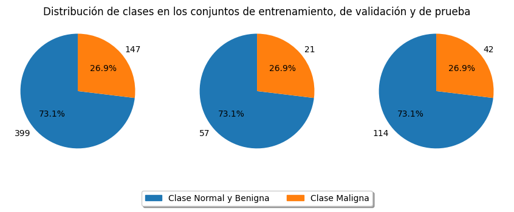
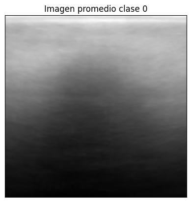
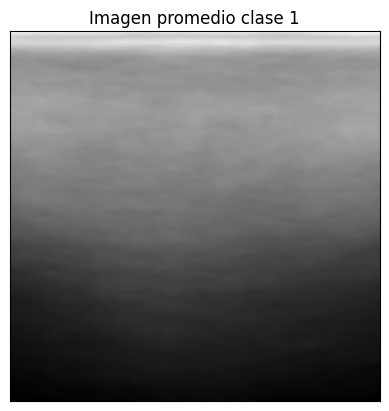
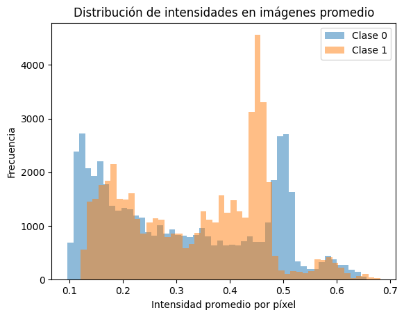
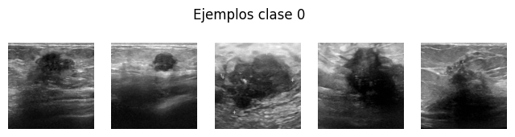
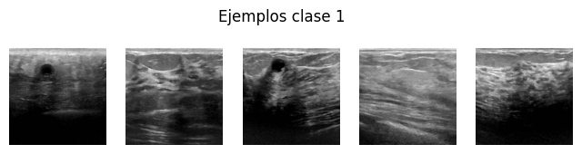

# 🧠 Detección de Cáncer de Mama con Aprendizaje Automático

Este proyecto busca desarrollar un modelo de clasificación binaria para detectar tejido maligno en imágenes ecográficas de mama, utilizando el dataset [BreastMNIST](https://medmnist.com/).

---

## 📌 Definición del Proyecto

Se exploran múltiples resoluciones de imagen (28×28, 64×64, 128×128, 224×224) y distintos enfoques de modelado (CNN, transfer learning y Vision Transformers) para determinar la mejor estrategia de diagnóstico automatizado. Se busca un balance entre precisión y costo computacional.

---

## 🧬 Descripción de los Datos

BreastMNIST incluye 780 imágenes ecográficas, transformadas a 1×28×28 px en escala de grises y etiquetadas como:
- **Clase 1 (positiva):** Tejido benigno o normal
- **Clase 0 (negativa):** Tejido maligno

Distribución:
- Entrenamiento: 546 imágenes  
- Validación: 78 imágenes  
- Prueba: 156 imágenes  

---

## 🔎 Análisis Exploratorio

- Las imágenes promedio muestran patrones de iluminación que podrían ayudar al modelo a diferenciar clases.
- Existe desbalance de clases, por lo que se prioriza el AUC-PR como métrica de evaluación.

<table>
    <tr>
        <td></td>
        <td></td>
    </tr>
</table>

---

## 🧪 Diseño de Experimentos

Se probaron los siguientes enfoques:

- Modelos **CNN** diseñados desde cero
- **Transfer Learning** con ResNet, DenseNet preentrenadas en imágenes médicas

📊 **Métricas**: Accuracy y AUC-PR  
📈 **Técnicas adicionales**: Bagging, Stacking

---